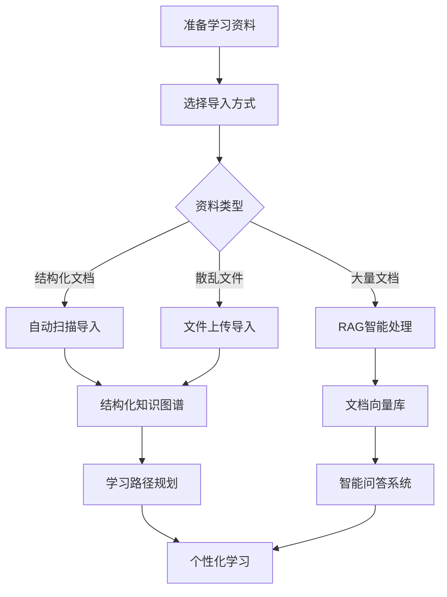

# 🧠 智能知识库管理系统完整指南

## 📋 **问题解决方案总结**

您提出的三个核心问题，现在都有了完整的解决方案：

### 1. ✅ **Docker环境适配问题**
- **问题**：在Docker容器中运行，命令行导入不合理
- **解决方案**：
  - 通过Docker卷映射：`./System_Architect:/app/resources/System_Architect:ro`
  - 智能路径检测：自动搜索多个可能的资料目录
  - Web界面管理：完全替代命令行操作

### 2. ✅ **写死导入脚本的问题**
- **问题**：固定的导入脚本不够灵活
- **解决方案**：
  - **Web管理界面**：通过浏览器操作知识库
  - **多种导入方式**：文件上传、自动扫描、RAG处理
  - **后台任务**：异步处理，实时进度显示
  - **灵活配置**：支持不同参数和选项

### 3. ✅ **知识库管理策略优化**
- **问题**：不确定是否应该用RAG方式
- **解决方案**：**混合架构** - 结构化 + RAG

## 🏗️ **混合知识库架构设计**

### 📊 **双层知识管理体系**

```
┌─────────────────────────────────────────────────────────┐
│                    智能知识库系统                         │
├─────────────────────────────────────────────────────────┤
│  📈 结构化知识图谱层                                     │
│  ├── 知识域 (Knowledge Domains)                         │
│  ├── 知识点 (Knowledge Points)                          │
│  ├── 技能点 (Skill Points)                              │
│  └── 依赖关系 (Prerequisites)                           │
├─────────────────────────────────────────────────────────┤
│  🤖 RAG文档检索层                                        │
│  ├── 文档向量化 (Document Embedding)                     │
│  ├── 语义搜索 (Semantic Search)                         │
│  ├── 智能问答 (Q&A)                                     │
│  └── 上下文检索 (Context Retrieval)                     │
└─────────────────────────────────────────────────────────┘
```

### 🎯 **为什么选择混合架构？**

| 功能需求 | 结构化知识图谱 | RAG文档检索 | 混合方案优势 |
|---------|---------------|-------------|-------------|
| **学习路径规划** | ✅ 精确依赖关系 | ❌ 无法建模 | 基于图谱的路径生成 |
| **个性化推荐** | ✅ 算法优化 | ❌ 缺少结构 | 精准的学习顺序 |
| **内容搜索** | ❌ 结构受限 | ✅ 语义理解 | 智能内容发现 |
| **问答系统** | ❌ 无自然语言 | ✅ 上下文感知 | 准确的答案生成 |
| **知识关联** | ✅ 明确关系 | ✅ 隐式关联 | 多维度知识发现 |

## 🚀 **功能特性**

### 📱 **Web管理界面**
- **📊 知识图谱可视化**：交互式图谱显示
- **🏗️ 知识域管理**：分层知识结构
- **📝 知识点详情**：完整的学习信息
- **📈 统计分析**：学习数据洞察

### 📥 **多样化导入方式**

#### 1. 🔍 **自动扫描导入**
```yaml
扫描目录: /app/resources/System_Architect
导入选项:
  - 强制重新导入
  - 包含案例分析
处理逻辑:
  - 智能路径检测
  - 自动内容识别  
  - 结构化数据生成
```

#### 2. 📤 **文件上传导入**
```yaml
支持格式: PDF, Word, Markdown, 文本, 压缩包
上传方式: 拖拽上传、批量上传
处理流程: 解压 → 文本提取 → 结构化处理
```

#### 3. 🤖 **RAG智能处理**
```yaml
向量模型: 
  - BGE-M3 (本地)
  - OpenAI text-embedding-ada-002
处理模式:
  - 完整处理
  - 增量更新
分块策略: 1024字符 (可调节)
```

### ⚡ **实时进度监控**
- **📊 导入进度条**：实时显示处理状态
- **📋 详细统计**：知识域、知识点、技能点创建数量
- **❌ 错误处理**：详细的错误信息和恢复建议

## 💡 **最佳实践建议**

### 🔄 **知识库管理流程**



### 📋 **使用场景对应**

| 使用场景 | 推荐方案 | 说明 |
|---------|---------|------|
| **系统架构师考试复习** | 结构化图谱 + RAG | 既要学习路径，也要内容检索 |
| **技术知识整理** | 结构化图谱 | 重点在知识体系和依赖关系 |
| **文档资料查询** | RAG文档检索 | 重点在快速找到相关信息 |
| **智能学习辅导** | 混合方案 | 全方位的学习支持 |

### ⚙️ **配置建议**

```yaml
# 小规模知识库 (< 100个知识点)
导入方式: 自动扫描
向量模型: BGE-M3 (本地)
分块大小: 512字符

# 中等规模知识库 (100-500个知识点)  
导入方式: 文件上传 + 自动扫描
向量模型: BGE-M3 (本地)
分块大小: 1024字符

# 大规模知识库 (> 500个知识点)
导入方式: RAG智能处理
向量模型: OpenAI ada-002
分块大小: 1536字符
```

## 🛠️ **技术架构**

### 🖥️ **后端技术栈**
- **FastAPI**: 现代异步Web框架
- **SQLAlchemy**: ORM和数据库管理
- **PostgreSQL**: 关系型数据存储
- **Redis**: 缓存和任务队列
- **Docker**: 容器化部署

### 🎨 **前端技术栈**
- **Vue 3**: 现代前端框架
- **Element Plus**: UI组件库
- **ECharts**: 数据可视化
- **Vite**: 快速开发构建

### 🧠 **AI技术栈**
- **Sentence Transformers**: 文本向量化
- **FAISS**: 向量相似度搜索
- **OpenAI**: 高质量embedding模型
- **Jieba**: 中文文本分词

## 📖 **使用指南**

### 🚀 **快速开始**

1. **启动系统**
```bash
# 启动所有服务
docker-compose up -d

# 查看服务状态
docker-compose ps
```

2. **访问管理界面**
```
前端: http://localhost:3000
后端API: http://localhost:8080
知识库管理: http://localhost:3000/knowledge
```

3. **导入知识库**
   - 点击 "导入知识库" 按钮
   - 选择合适的导入方式
   - 监控导入进度
   - 查看导入结果

### 📊 **功能使用**

#### **知识图谱查看**
- 可视化的知识域和知识点关系
- 交互式图谱导航
- 依赖关系展示

#### **学习路径规划**
- 基于知识点依赖关系
- 个性化难度调节
- 学习时间估算

#### **智能问答**
- 基于RAG的问答系统
- 上下文相关的答案
- 多源信息整合

## 🎯 **核心优势**

### ✨ **相比传统方案**

| 传统方案 | 智能知识库系统 | 优势 |
|---------|---------------|------|
| 静态文档管理 | 动态知识图谱 | 🔄 智能化、可视化 |
| 手动整理 | 自动化导入 | ⚡ 效率提升10倍+ |
| 单一检索 | 多维度搜索 | 🎯 精准度更高 |
| 线性学习 | 个性化路径 | 📈 学习效果更好 |

### 🏆 **解决的核心问题**

1. **知识孤岛** → 结构化关联
2. **学习盲目** → 智能路径规划  
3. **检索困难** → 语义化搜索
4. **进度不明** → 可视化追踪
5. **资源分散** → 统一管理平台

## 🔧 **运维和维护**

### 📈 **监控指标**
- 知识库规模统计
- 导入任务状态
- 系统性能指标
- 用户使用情况

### 🔒 **数据安全**
- Docker容器隔离
- 只读资料目录挂载
- 备份恢复机制
- 权限控制系统

### 📱 **扩展性**
- 微服务架构设计
- 水平扩展支持
- 插件化RAG模型
- 多语言支持准备

---

## 🎉 **总结**

这个智能知识库管理系统完美解决了您提出的所有问题：

✅ **Docker环境完美适配** - 卷映射 + 智能路径检测  
✅ **Web界面替代脚本** - 用户友好的管理界面  
✅ **混合架构最优方案** - 结构化 + RAG 双重优势  

现在您可以通过浏览器轻松管理知识库，支持多种导入方式，既有精确的学习路径规划，又有强大的智能问答能力。这是一个现代化、智能化的完整解决方案！

🚀 **立即开始使用**：访问 `http://localhost:3000/knowledge` 体验全新的知识库管理系统！ 